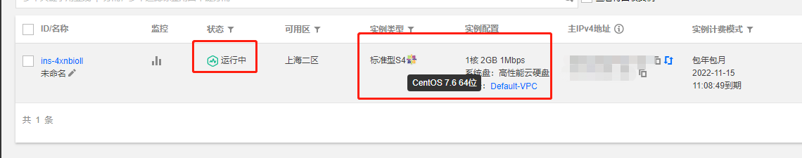
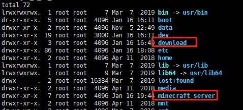
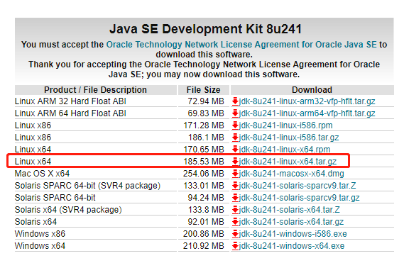
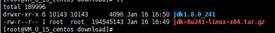
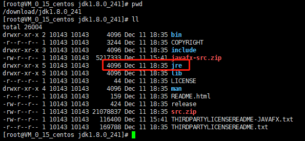
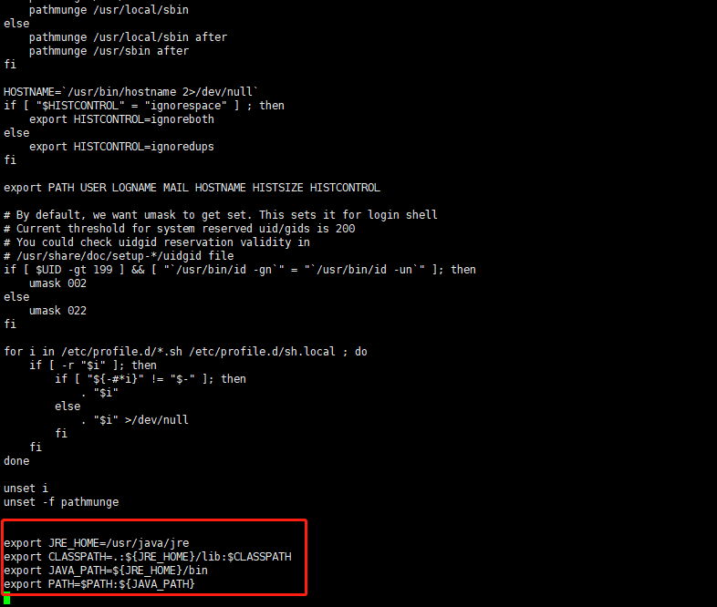
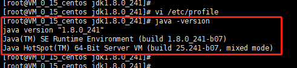
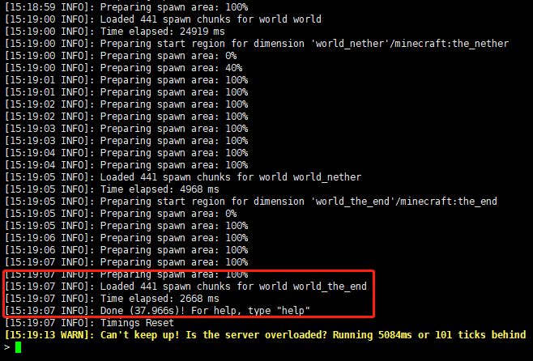
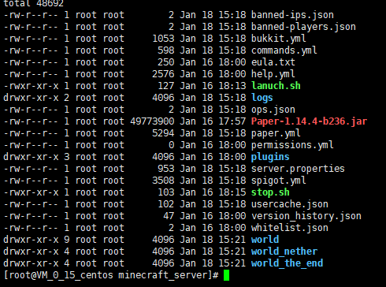
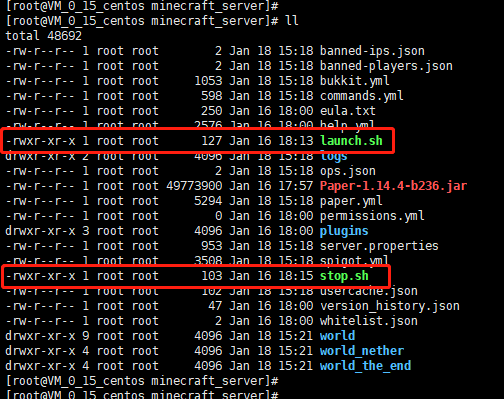

## 前言

### 前排提示

> 本文并不适合对于Linux不了解的新手，对于小白玩家或者新手，强烈推荐此篇教程[【Linux&开服教程】从零开始的Linux服务器技术从萌新到入门教程](https://www.mcbbs.net/thread-894575-1-1.html)

前段时间特价买了一台腾讯云服务器(1核2G)，由于比较忙，一直闲置状态。等到年底事情忙完了，就开始搭建一个我的世界服务器，准备春节和朋友一起联机游玩。
系统选择的是 **CentOs 7**，其他Linux系统操作类似，本文仅作为本人搭建的记录,并不严谨，仅供参考。

### 运行环境

    操作系统：CentOS 7.6 64位
    Java:jdk1.8.0_241
    我的世界服务端Server:Paper-1.14.4-b236
    我的世界客户端:Minecraft 1.14
    SSH客户端:Xshell
    FTP客户端:XFtp

## 准备一台作为服务器的主机

我买的是一台腾讯云服务器，阿里云或者其他云服务器类似，操作很简单。如何购买服务器以及初始化主机可以百度解决。


## 准备工作

### 远程连接服务器

使用任意SSH客户端连接到准备好的Linux服务器，我这里使用的是Xshell
新建两个文件夹，download以及minecraft_server。download文件夹用来存储下载的文件，我的世界服务端安装在minecraft_server文件夹。


### 下载Java

根据机器的情况选择对应版本，我选择的是[Linux x64版本](https://www.oracle.com/technetwork/java/javase/downloads/jdk8-downloads-2133151.html)


### 安装Java

安装Java过程可以看[Linux 下安装JDK1.8](https://www.cnblogs.com/xuliangxing/p/7066913.html)，我也记录下我的安装过程。

由于我是本地下载的java，所以下载完成后手动用ftp工具上传到之前创建的download目录，一般阿里云和腾讯云的服务器都自动开启了22端口，直接使用工具连接即可。

然后使用进入jdk-8u241-linux-x64.tar.gz所在目录
```
cd  /download
```
解压jdk-8u241-linux-x64.tar.gz
```
tar  -zxvf  jdk-8u241-linux-x64.tar.gz
```
解压后完成后会看到jdk


要将jdk安装在usr/java当中，所以在usr目录下新建一个java文件夹
```
mkdir /usr/java
```
本人已测试，我的世界服务器server端仅需要jre即可运行，所以我们只需安装jre即可，先进入刚才解压好的java目录
```
cd  /download/jdk1.8.0_241
```

然后安装jre到/usr/java目录
```
mv /download/jdk1.8.0_241/jre /usr/java
```
接下来使用vim修改环境变量
```
vim /etc/profile
```
在文件末尾添加，其中JRE_HOME写刚才jre的安装路径
```
export JRE_HOME=/usr/java/jre
export CLASSPATH=.:${JRE_HOME}/lib:$CLASSPATH
export JAVA_PATH=${JRE_HOME}/bin
export PATH=$PATH:${JAVA_PATH}
```

完毕后保存退出，在任意目录下执行java命令检查是否设置成功
```
java -version
```
显示java版本号即表示成功


## 安装我的世界服务器server端
首先进入刚才建好的minecraft_server目录，可以使用如下命令下载server端，我选择的是Paper-1.14.4-b23版本。
```
wget https://yivesmirror.com/files/paper/Paper-1.14.4-b236.jar
```
也可以去[Yive's Mirror](https://yivesmirror.com/downloads/paper)自行选择下载任意版本，然后通过ftp工具上传到minecraft_server目录。

## 运行我的世界服务器server
进入目录，然后用java -jar命令启动运行文件
```
cd minecraft_server/
java -jar Paper-1.14.4-b236.jar
```
等待运行完成

完成后输入stop关闭服务器，就可以看到目录下完整的配置文件了


## 新建后台启动脚本
我们使用screen工具来后台启动，所以先安装screen
```
yum install screen
```
安装完成后，使用touch命令新建启动脚本
```
touch launch.sh
```
然后编辑lauch.sh文件
```
vim launch.sh
```
添加下面的命令，其中-Xmx可以根据自己的机器内存情况适当调整
```
screen -dmS mc java -Xms512m -Xmx1224m -XX:+AggressiveOpts -XX:+UseCompressedOops -jar /minecraft_server/Paper-1.14.4-b236.jar
```
然后再新建关闭脚本并编辑
```
touch stop.sh
vim stop.sh
```
添加关闭命令
```
screen -dr mc -X stuff "say 服务器将在10S后关闭！\n"
sleep 10
screen -dr mc -X stuff "stop\n"
```
两个脚本都创建好之后，使用chmod命令添加执行权限
```
chmod +x launch.sh
chmod +x stop.sh
```
接下来就能看到launch.sh和stop.sh都变成可以执行文件了

大功告成之后我们就可以使用脚本来进行后台起停操作了

启动服务器
```
./launch.sh
```
关闭服务器
```
./stop.sh
```

## 其他事项

### 服务器参数配置

服务器参数使用server.properties文件及其他yml文件设置，具体设置可以参考[Minecraft服务器优化教程 —— 让多带50%的玩家不再是梦](https://www.mcbbs.net/thread-478126-1-1.html)

### 如何使用客户端并游玩

参见[我的世界Minecraft Java版 下载指南|文件结构说明|推荐启动器](https://www.mcbbs.net/thread-38297-1-1.html)

### 服务器运行状态查看

查看游戏目录安装目录下的/minecraft_server/logs文件夹的latest.log文件

## 参考资料及感谢

[Linux下搭建带mod的Minecraft服务器](https://www.jianshu.com/p/89f14756d16c)

[Ubuntu(Linux)开服教程](https://www.mcbbs.net/thread-770886-1-1.html)
