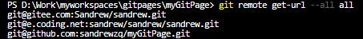

1. 使用git remote add添加一个remote,我这里命名为all，后面写上第一个repository地址
```
git remote add all git@github.com:sandrewzq/myGitPage.git
```
2. 继续添加repository
```
git remote set-url --add all git@gitee.com:Sandrew/sandrew.git
git remote set-url --add all git@e.coding.net:sandrew/sandrew/sandrew.git
```
3.完成后使用命令即可看到已添加成功

```
git remote get-url --all all
```
