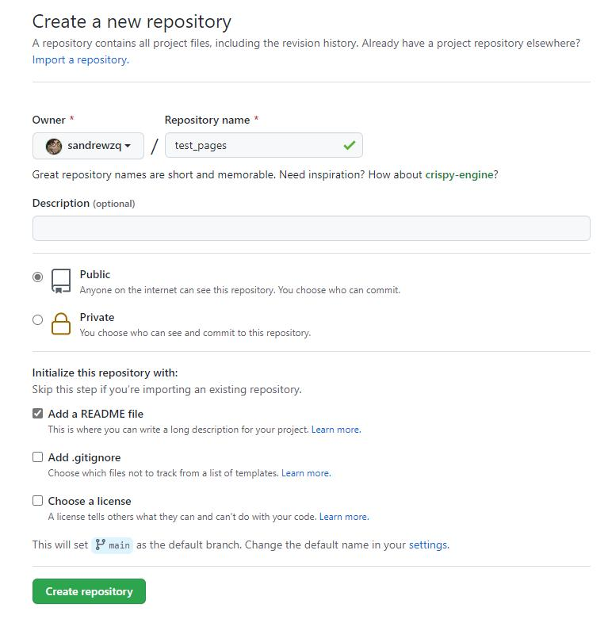
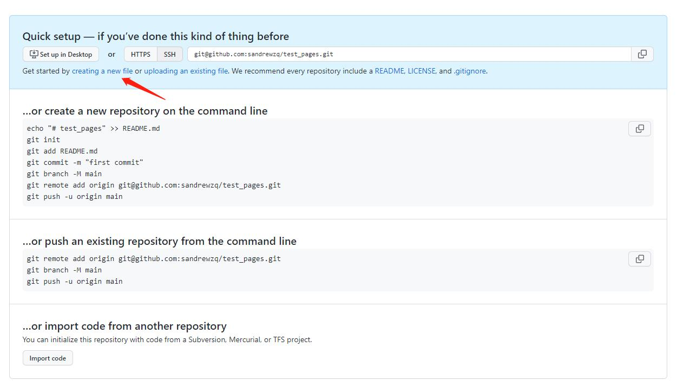
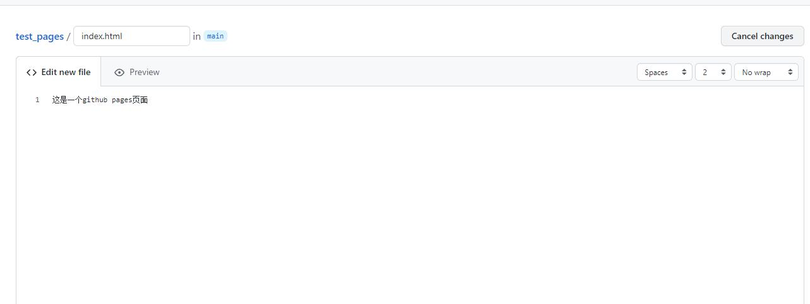
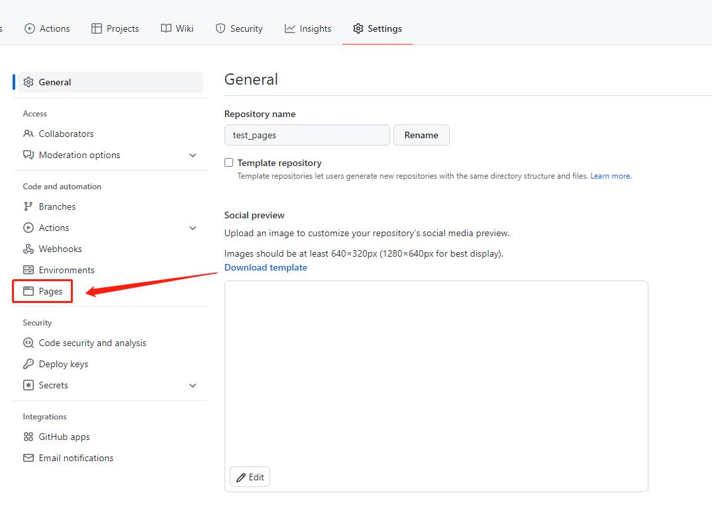
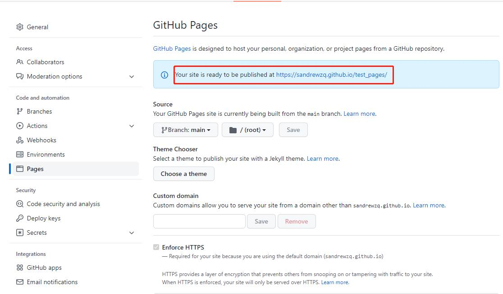

## 1.什么是Github Pages及Gitee Pages
显而易见，从名字上就可以轻易地看出这两个'Pages'分别属于两家代码托管服务。
对于GitHub Pages，其官方文档是这样介绍的:
> GitHub Pages是一个静态站点托管服务,可以通过部署程序把HTML，CS和JavaScript等文件组成的静态库发布成为一个静态站点。

而Gitee Pages的核心功能与Github Pages一样，都是提供一个静态站点托管服务。可以通过这两种服务搭建一个轻量化博客或者静态个人站。

## 2.Pages服务的优点
相比于著名的WordPress博客系统，Pages服务最大的优势就是轻量化，无需LAMP环境。而且它完全免费，也不需要部署服务器的费用。

## 3.Pages快速开始
> 以Github Pages举例，Gitee Pages操作基本一致。
1. 在GitHub中新建一个test_pages仓库，选择Repository权限为public。

2. 创建仓库成功后，点击creating a new file，新建一个文件。

3. 文件名必须为index.html。内容为'这是一个github pages页面',然后点击save保存。

4. 接着在仓库的setting页签下点击左侧的Pages菜单。

5. 选择对应的分支及目录后，点击save按钮，稍后即可看到成功提示及链接。(注意：假如仓库为private权限，此处会提示需要把仓库转换为public或者升级为GitHub Pro服务才可用)

## 4. Pages 进阶，使用 Jekyll、Hugo、Hexo、docsify等生成自己的静态网页
Jekyll、Hugo、Hexo、docsify 是简单的博客形态的静态站点生产机器。它有一个模版目录，其中包含原始文本格式的文档，通过 Markdown 以及 Liquid 转化成一个完整的可发布的静态网站，你可以发布在任何你喜爱的服务器上。
Jekyll 使用文档：https://www.jekyll.com.cn/docs/home/
Hugo 使用文档：https://gohugo.io/documentation/
Hexo 使用文档：https://hexo.io/docs/
docsify 使用文档：http://www.yii-china.com/docsify/

#### 参考链接
[GitHub Pages快速入门](https://docs.github.com/cn/pages/quickstart)
[Gitee Pages官方文档](https://gitee.com/help/articles/4136)
[GitHub Pages 搭建教程](https://sspai.com/post/54608)