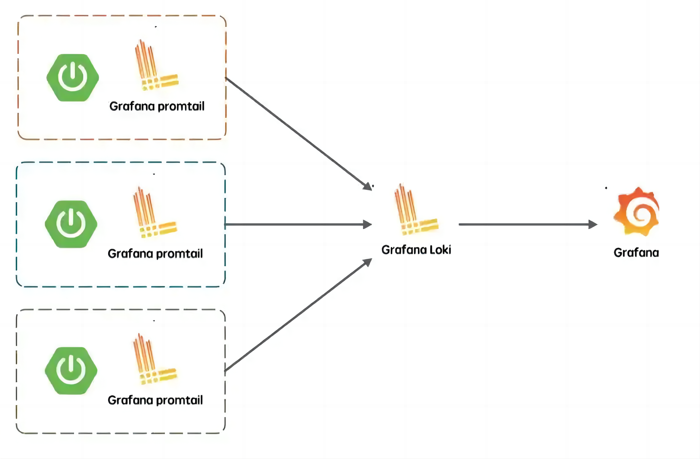
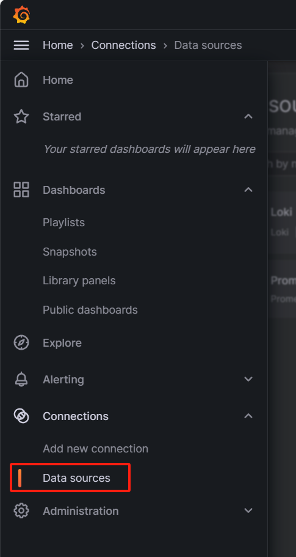
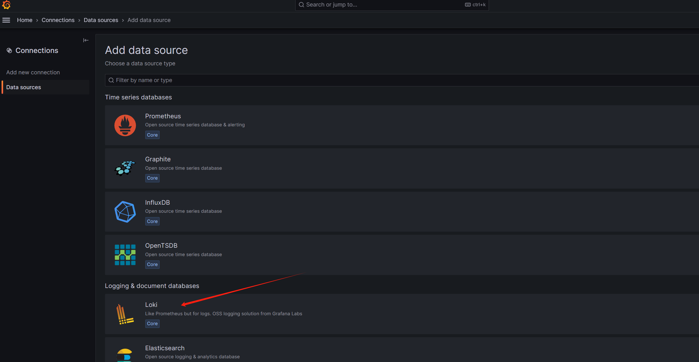
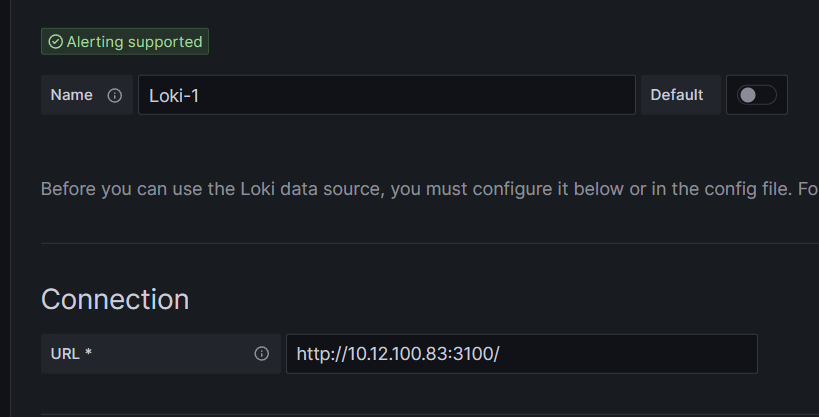
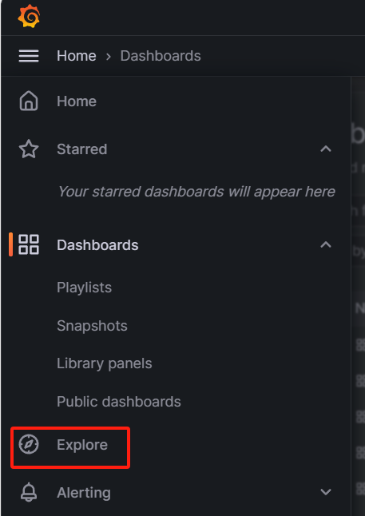
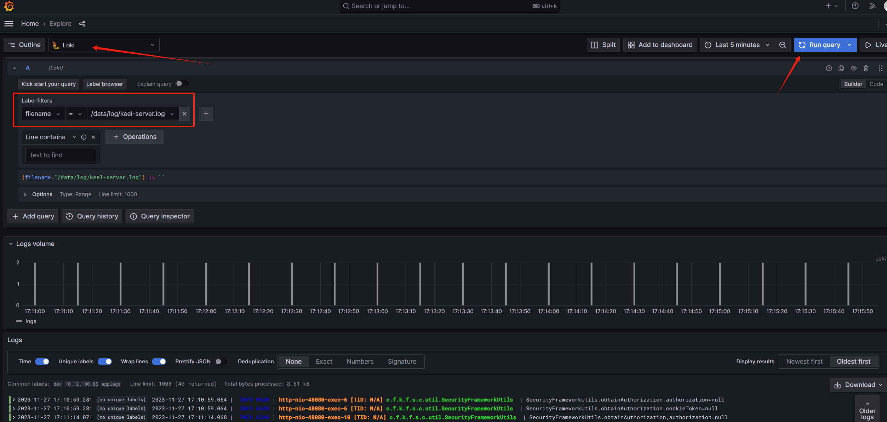
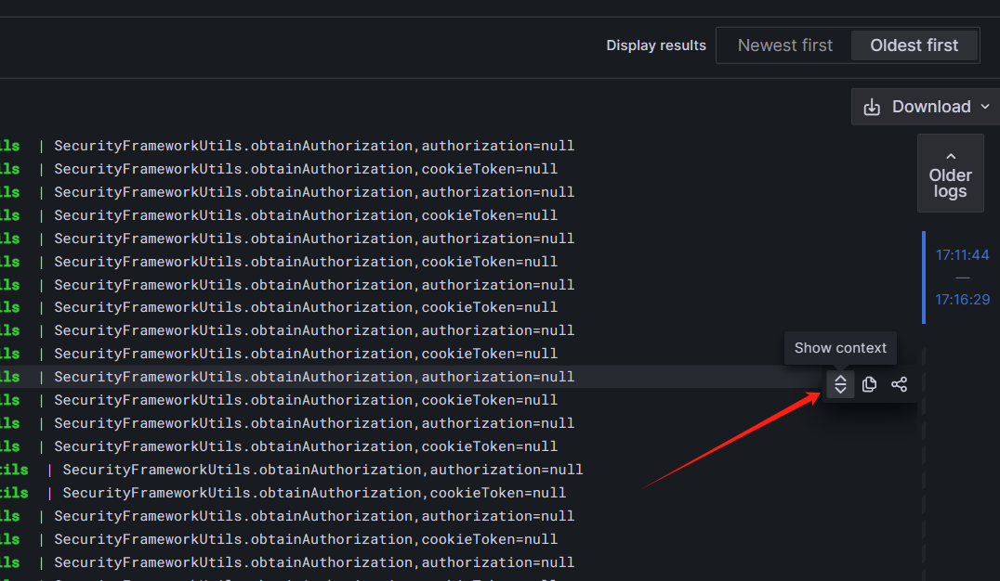

# Loki日志系统部署

## 介绍

Loki 是一个由Grafana Labs 开发的开源日志聚合系统，旨在为云原生架构提供高效的日志处理解决方案。

Loki 通过使用类似 Prometheus 的标签索引机制来存储和查询日志数据，这使得它能够快速地进行分布式查询和聚合，而不需要将所有数据都从存储中加载到内存中。Loki还使用了压缩和切割日志数据的方法来减少存储空间的占用，从而更好地适应云原生环境下的高速增长的日志数据量。

Loki的架构由以下几个主要组件组成：

Promtail: 负责采集应用程序和系统的日志数据，并将其发送到 Loki 的集群中。

Loki:负责存储日志数据，提供 HTTP API 的日志查询，以及数据过滤和筛选。

Grafana: 负责 UI 展示日志数据。



## Loki对比ELK

### 优点：

*   存储资源占用小：Loki 可以通过压缩和切割日志数据的方法来控制磁盘占用。  


*   内存资源占用小：Loki 使用标签索引机制存储和查询日志数据，不需要将所有数据都从存储中加载到内存中。


*   部署简单：Loki的架构简单，仅部署三个组件即可使用，是一个轻量级的日志聚合系统。


*   资源可复用：在日志的可视化上可以使用 Grafana，可以和Prometheus 监控共用，节省系统资源。

### 缺点：

*   系统较新，不如ELK社区活跃。


*   ELK有强大的可视化功能，Loki的可视化功能较为简单。


*   ELK 可以连用各种技术进行日志的大数据处理，但是 loki 不行。


*   ELK是分布式系统，可以通过增加节点来提高扩展性，Loki是单节点系统。

结合中交项目的特点，故选择Loki日志系统。

# Loki部署示例

## 下载组件

Loki下载地址：<https://github.com/grafana/loki/releases>

Promtail下载地址：<https://github.com/grafana/loki/releases>

Grafana下载地址：<https://grafana.com/grafana/download?edition=oss>

## 安装loki

解压loki-linux-amd64.zip到安装目录

打开安装目录，创建配置文件loki-config.yml，配置文件参考

```yaml
auth_enabled: false
server:
  http_listen_port: 3100
common:
  ring:
    instance_addr: 127.0.0.1
    kvstore:
      store: inmemory
  replication_factor: 1
  path_prefix: /data/loki
schema_config:
  configs:
  - from: 2020-05-15
    store: boltdb-shipper
    object_store: filesystem
    schema: v11
    index:
      prefix: index_
      period: 24h
limits_config:
  reject_old_samples: true
  reject_old_samples_max_age: 168h
chunk_store_config:
  # 最大可查询历史日期 90天
  max_look_back_period: 2160h
# 表的保留期90天  
table_manager:
  retention_deletes_enabled: true
  retention_period: 2160h
```

启动Loki

```shell
nohup ./loki-linux-amd64 -config.file=/data/loki/loki-config.yml &
```

## 安装Promtail

解压promtail-linux-amd64.zip到安装目录

打开安装目录，创建配置文件config-promtail.yml，配置文件参考，clients-url修改为Loki的安装地址

```yaml
server:
  http_listen_port: 9080
  grpc_listen_port: 0
positions:
  filename: /tmp/positions.yaml # This location needs to be writeable by Promtail.
clients:
  - url: http://10.12.100.83:3100/loki/api/v1/push
scrape_configs:
 - job_name: system
   pipeline_stages:
   static_configs:
   - targets:
      - localhost
     labels:
      env: dev
      job: applogs  # A `job` label is fairly standard in prometheus and useful for linking metrics and logs.
      host: 10.12.100.85 # A `host` label will help identify logs from this machine vs others
      __path__: /data/log/*.log  # The path matching uses a third party library: https://github.com/bmatcuk/doublestar
```

启动promtail

```shell
nohup ./promtail-linux-amd64 -config.file=/data/promtail/config-promtail.yml &
```

## 安装Grafana

```shell
yum install -y grafana-10.2.0-1.x86_64.rpm
```

## Grafana 添加数据源

左侧导航栏选择Connections-Data sources并新建



选择Loki并创建



Connection-url填入Loki地址及参数



点击Save & Test，提示Data source successfully connected即代表成功。


# 使用Loki查看日志

点击左侧Explore



最上面下拉选择刚才创建好的Loki数据源，再选择自定义的label标签，点击Run Query即可看到日志



查看上下文方法，点击某行日志的的Show context按钮即可



## 参考文档

1. [Loki官方部署文档](https://grafana.com/docs/loki/latest/get-started/)

1. [Loki配置文件说明](https://grafana.com/docs/loki/latest/configure/)

1. [Promtail配置文件说明](https://grafana.com/docs/loki/latest/send-data/promtail/configuration/)

1. [日志收集系统loki部署](https://blog.51cto.com/u_15315026/3206956)

