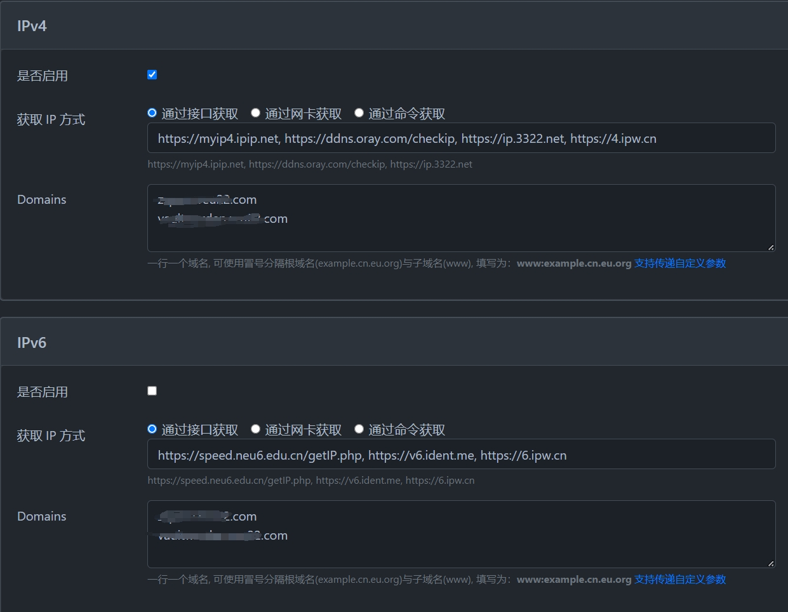

# 极空间通过docker实现公网域名访问

## 必要前置条件

1. 路由器能获取到公网ip
2. 路由器有管理员权限，可配置端口转发
3. 已经注册好的域名，本文以阿里云域名为例，其他注册商操作类似

## 安装ddns-go

首先打开docker仓库搜索jeessy/ddns-go镜像并下载

### 创建容器

文件夹路径自行填写即可

网络配置不用动

端口自定义即可

最后点击应用创建完成

## 设置云解析、获取阿里云ak/sk

### 获取阿里云ak/sk

打开通过设置好的端口打开ddns-go页面
选择aliyun并点击创建 AccessKey

## 配置DDNS-GO

填写对应的AccessKey ID及AccessKey Secret，设置好后点击上面的保存

往下再根据自己的网络情况和需求分别设置ipv4及ipv6
如果是根域名转发则填写
`*.你的域名.com`
其他情况则自行根据情况填写

其他栏根据自己的情况自行设置，最好勾选禁止外网访问

都设置好后点击最下面的保存

最后登录到阿里云域名解析页查看是否记录成功，如没有也可以手动创建。稍等一会显示对应的公网ip则说明设置成功

## 验证

通过设置好的域名访问

## 参考

1. [外网访问极空间和容器：使用DDNS-GO和IPv6](https://www.hao4k.cn/thread-73968-1-1.html)

2. [极空间Nas-Docker篇-[ddns-go ]](https://www.chenweikang.top/?p=1062)
