# 极空间申请ssl证书实现https访问

## 必要前置条件

1. 已经实现公网域名访问，请参考：[极空间通过docker实现公网域名访问](../2024-01-25-极空间通过docker实现公网域名访问/index.md)

## nginx-proxy-manager

首先打开docker仓库搜索chishin/nginx-proxy-manager-zh镜像并下载

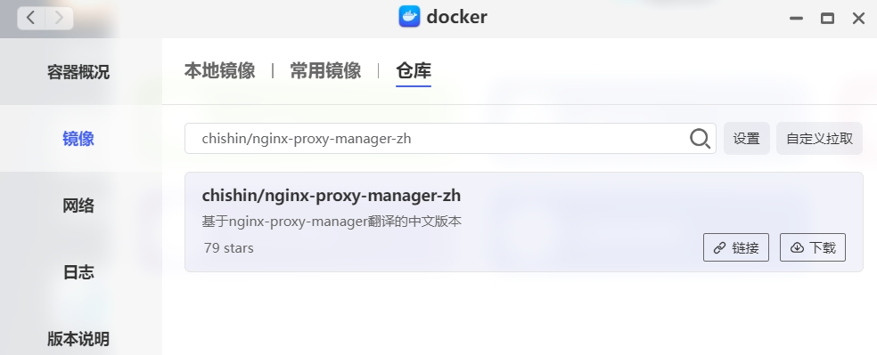

### 创建容器

文件夹路径自行填写即可

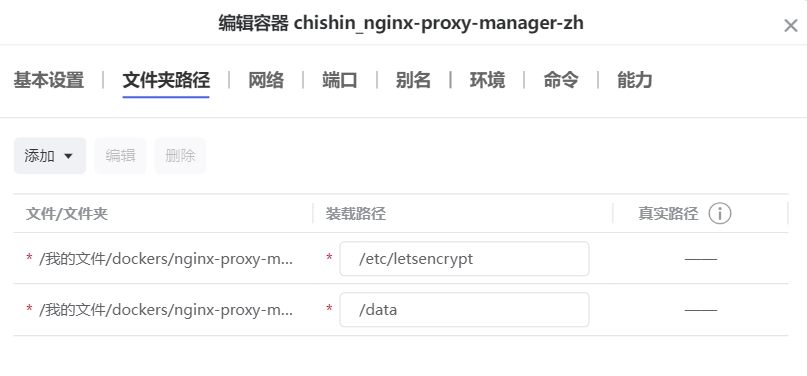

网络配置不用动，端口自定义即可

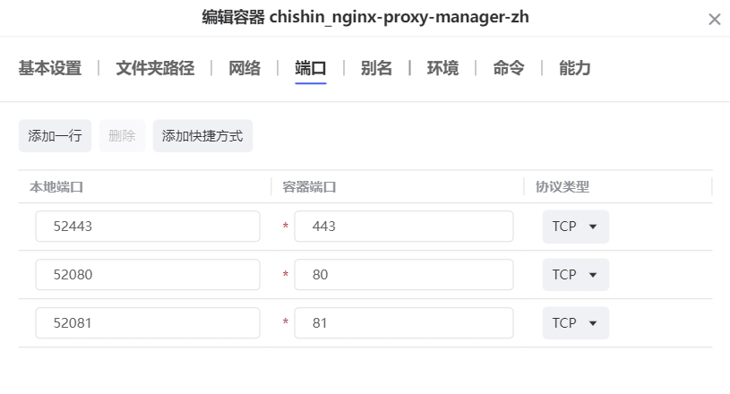

最后点击应用创建完成

### 设置反向代理

使用内网IP+刚才映射的81对应的端口访问管理页面，使用默认登录邮箱和密码登录，登录后设置自己的邮箱及密码。
（默认邮箱：admin@example.com   默认密码: changeme）

登陆后点击代理服务

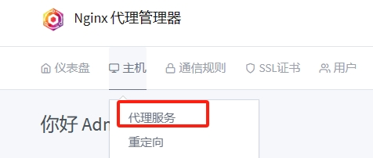

点击添加代理服务，并填入需要代理的域名，协议不用动，转发ip填写需要转发的内网ip，端口填写需要转发的服务的对应端口，再勾选阻止常见漏洞，最后点击保存

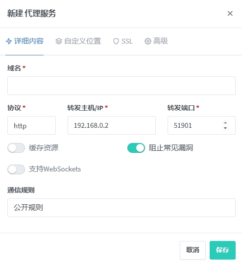

通过刚才设置好的规则里的域名及端口访问测试，能打开即代表转发成功

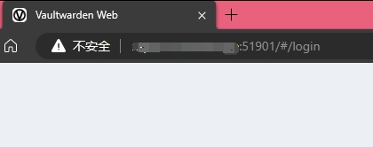

## 配置https访问

### 申请ssl证书

#### 方式1

选择“SSL证书”页面，点击右上角的“添加SSL证书”，选择Let's Encrypt

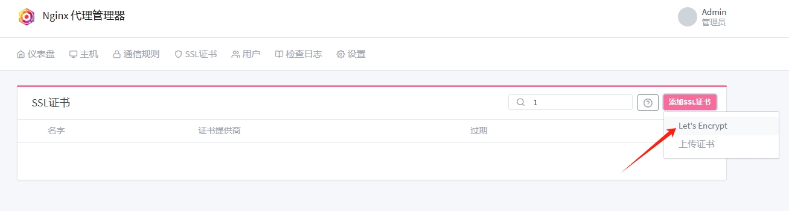

根据页面提示填写，Let's Encrypt栏填写要接收信息的邮箱，勾选DNS认证，选择aliyun的dns，并填写accesskey及access_key_secret

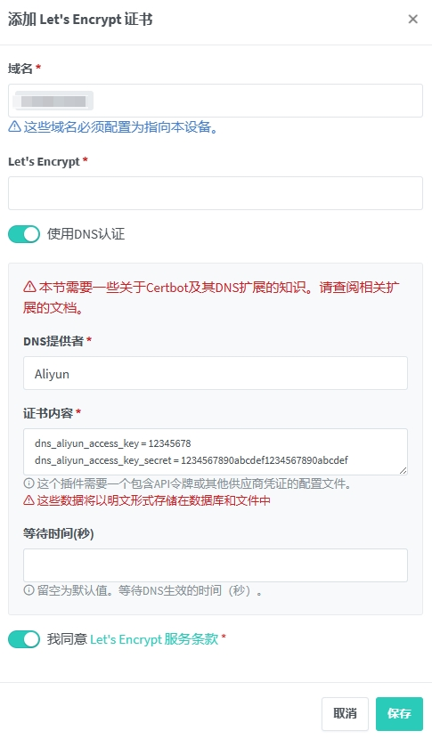

最后点击保存，等待申请成功

#### 方式2

选择“SSL证书”页面，点击右上角的“上传证书”

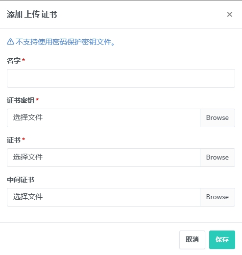

填入信息并上传证书皆可

### 配置ssl

回到最开始创建的代理服务，点击编辑

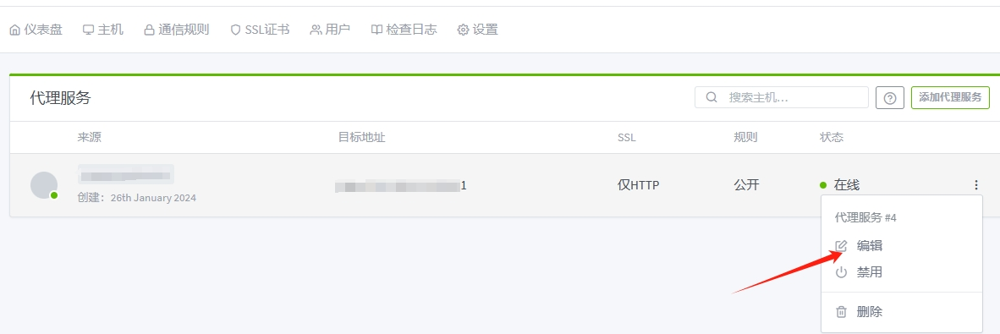

在ssl栏选择刚才申请好的证书，并勾选对应的设置

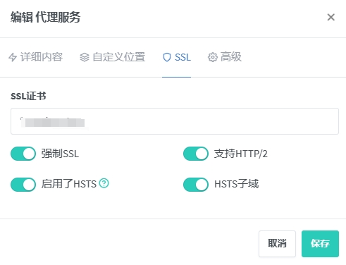

最后点击保存即可

## 验证

使用“https://设置好的域名:docker里443转发的端口”来测试下访问

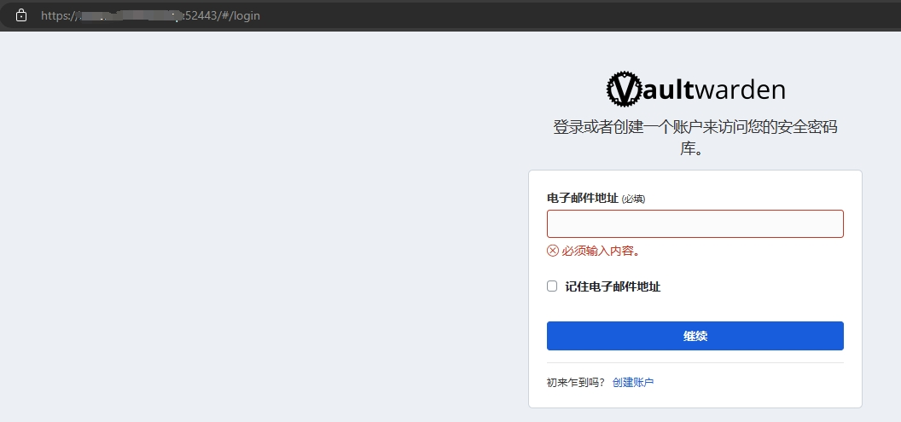

## 参考

1. [极空间NginxProxyManager部署及应用教程](https://www.hao4k.cn/thread-73967-1-1.html)
